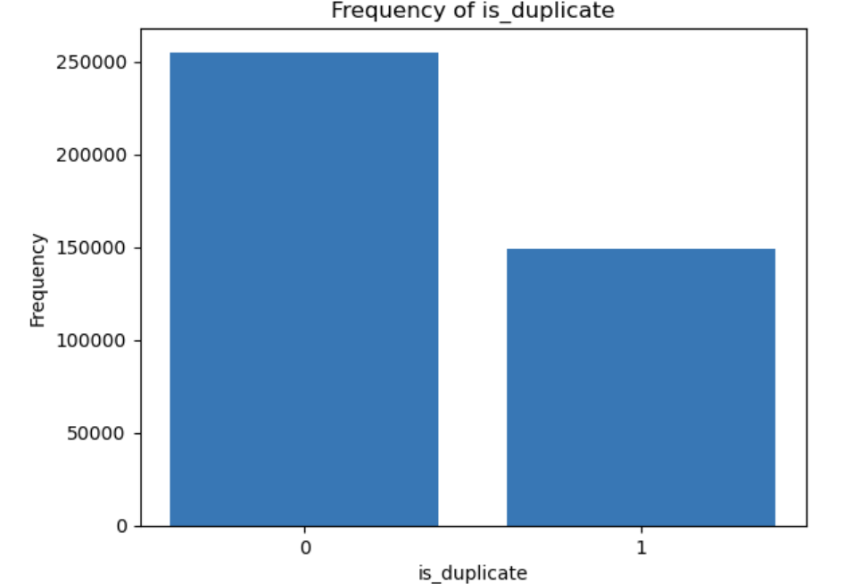
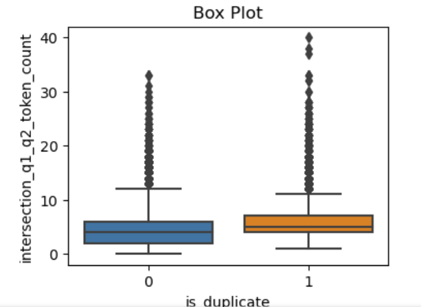
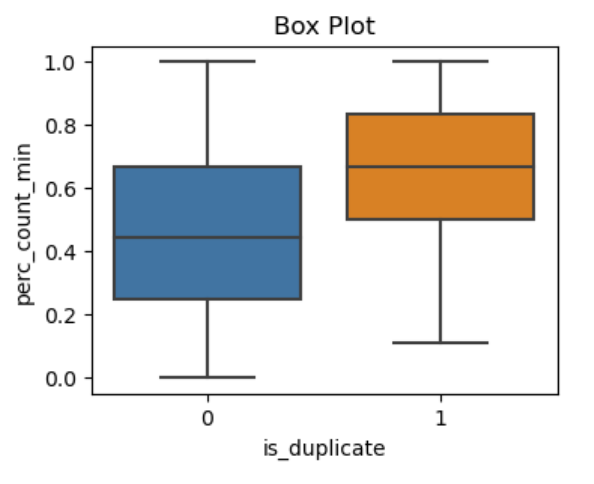
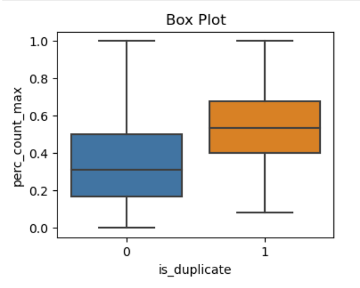
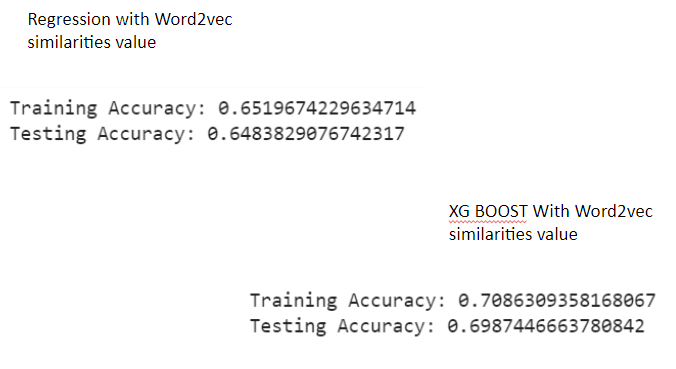
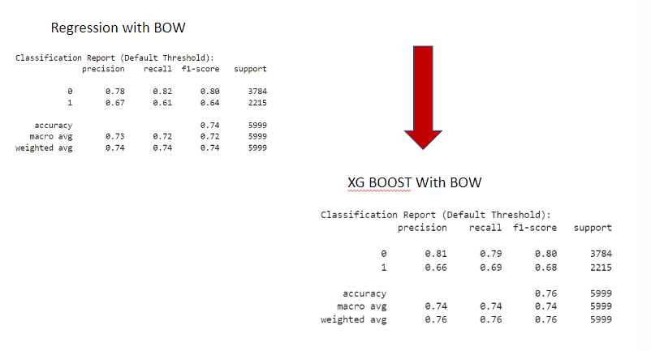
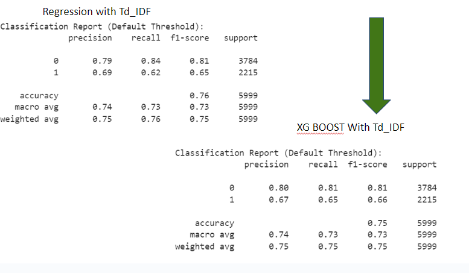
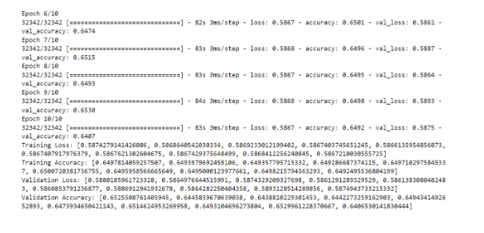

mini-project-V

# Note
During this exercise, I experienced many Kernel shut down:
- I couldn't balance the data
- I had to split my codes in different files and call intermediate table
- limit my sample of work to 30000 rows
- Select models with less computerization requirements

## Project Scope
Develop a model to predict duplicated Quora questions

## Processsus
- EDA
- Cleaning
- Selecting features
- Testing models
- Modeling a Neuron network
- Identifying future steps

## EDA Insights at a glance

- We have 3 Nulls questions

-The data classes is imbalanced

- Comparison between duplicated and non duplicated with common words shows a difference (need hypotheses check)

- Comparison between duplicated and non duplicated regarding ratio of common words over shortest q1,q2 questions shows a difference.

- Comparison between duplicated and non duplicated regarding ratio of common words over longest q1,q2 questions shows a difference.
difference.

- Some questions are duplicated but wrongly labelled

- Many questions are repeated: 537933 are unique (66% of total)

## Cleanning
The following steps were followed:
- removing punctuation
- removing stops words with no selection- time constraint
- tokenization
- Stemming: I didn't find it useful. I would rather have tried lemmatization instead.

## feature selection
I tried this exercise with different features:
### Vector representation
- Bag of words
- TF-IDF
- Word2vec
### others
- similarity values using cosine formula calculated by batches.
- Ratio common words to shortest question: percent_min
- Ratio common words to longest question: percent_max

## Models

### Using Word2vec
Features considered:
- similarities Value: I calculated an average vector based on the words vector for each question. Then I calculated their similarity value using cosin.
- percent_min
- percent_max

Classical models considered: 
- Logistic regression
- XGboost classifier
Results:

### Using BOW
Features considered:
- similarities Value: I calculated q1 and q2 similarity value using cosin based on BOW values
- BOW features
- percent_min
- percent_max

Classical models considered: 
- Logistic regression
- XGboost classifier and XGboost with gridsearch 

Results:

### Using TFIDF
Features considered:
- similarties Value: I calculated q1 and q2 similarity value using cosin based on TFIDF values
- TFIDF features
- percent_min
- percent_max

Classical models considered: 
- Logistic regression
- XGboost classifier 

Results:

Based on F1 score the best model is XGBOOST with TDIDF features

## USING Neuron Network

Since my machine computation was low I build a very simplistic NN with 3 dense layer and a sigmoid activation on the last layer similar to a regression using the Word2vec features above. I run it for only 10 epochs.

# Future steps:
- Using google collab and build more complex NN.
- find better features.
- Balance classes

